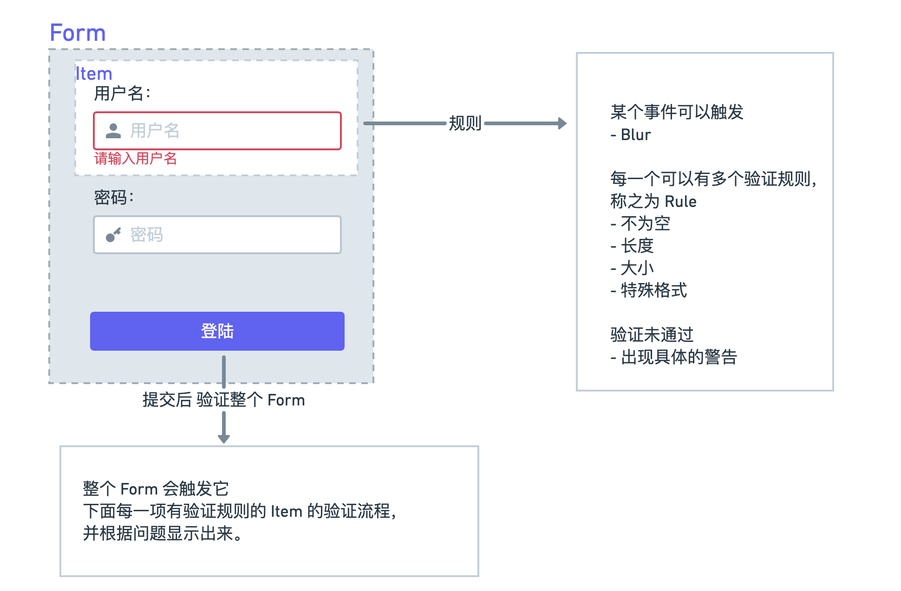

## 一、表单

**需求分析**



## 二、简单实现

**Bootstrap Form文档地址： [https://v5.getbootstrap.com/docs/5.0/forms/overview](https://v5.getbootstrap.com/docs/5.0/forms/overview/)**

```html
 <form action="">
    <div class="mb-3">
      <label for="exampleInputEmail1" class="form-label">邮箱地址</label>
      <input
        type="text" class="form-control" id="exampleInputEmail1"
      >
    </div>
    <div class="mb-3">
      <label for="exampleInputPassword1" class="form-label">密码</label>
      <input type="password" class="form-control" id="exampleInputPassword1">
    </div>
  </form>
```

验证表单的逻辑处理, 现在有两个规则，不能为空，和需要是邮件地址

```vue
<script lang="ts">
import { defineComponent, reactive } from 'vue'
import 'bootstrap/dist/css/bootstrap.min.css'

const emailReg = /^[a-zA-Z0-9.!#$%&’*+/=?^_`{|}~-]+@[a-zA-Z0-9-]+(?:\.[a-zA-Z0-9-]+)*$/
export default defineComponent({
  name: 'App',
  setup() {
    const emailRef = reactive({
      val: '',
      error: false,
      message: ''
    })
    const validateEmail = () => {
      if (emailRef.val.trim() === '') {
        emailRef.error = true
        emailRef.message = 'can not be empty'
      } else if (!emailReg.test(emailRef.val)) {
        emailRef.error = true
        emailRef.message = 'should be valid email'
      }
    }
    return {
      emailRef,
      validateEmail
    }
  }
})
</script>
```

添加提示语显示位置

```html
<div class="mb-3">
    <label for="exampleInputEmail1" class="form-label">邮箱地址</label>
    <input type="text" class="form-control" id="exampleInputEmail1" />
    <!--添加提示语显示位置-->
    <div class="form-text" v-if="emailRef.error">{{emailRef.message}}</div>
</div>
```

