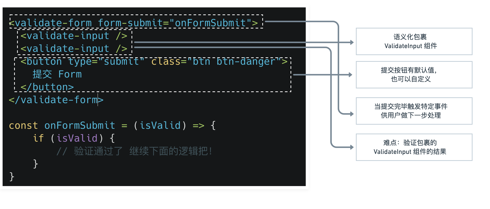

##  一、需求分析



## 二、使用插槽 slot

**Vue3 具名插槽 Named Slots 文档地址：https://v3.cn.vuejs.org/guide/component-slots.html#%E5%85%B7%E5%90%8D%E6%8F%92%E6%A7%BD**

### 1、创建`ValidateForm.vue`

```vue
<template>
  <form class="validate-form-container">
    <slot name="default"></slot>
    <div class="submit-area" @click.prevent="submitForm">
      <slot name="submit">
        <button type="submit" class="btn btn-primary">提交</button>
      </slot>
    </div>
  </form>
</template>

<script lang="ts">
import { defineComponent } from 'vue'
export default defineComponent({
  emits: ['form-submit'],
  setup(props, context) {
    const submitForm = () => {
      context.emit('form-submit', true)
    }
    return {
      submitForm
    }
  }
})
</script>
```

### 2、父组件使用插槽

`v-slot:submit`可以缩写为`#submit`

```html
<validate-form>
    <div class="mb-3">
        <label class="form-label">邮箱地址</label>
        <validate-input :rules="emailRules" v-model="emailValue" type="text" palceholder="请输入邮箱地址"></validate-input>
    </div>
    <template v-slot:submit>
        <span class="btn btn-danger">Submit</span>
    </template>
</validate-form>
```

### 3、使用的时候触发事件获取结果

```html
<!-- 添加事件触发函数 -->
<validate-form @form-submit="onFormSubmit">
    ……
</validate-form>
```

添加JavaScript代码

```javascript
const onFormSubmit = (result:boolean) => {
    console.log('result', inputRef.value.validateInput())
}
```

